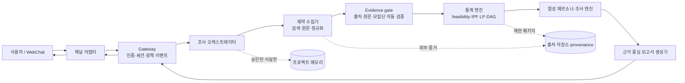

# 페르소나 복원기

> 공표된 통계표에 남은 제약으로 사라진 결합구조를 복원하되, 되살릴 수 없는 부분은 되살아난 척하지 않는 합성 정책조사 챗봇.

## 1. 프로젝트 정의

사용자는 자연어로 대상 집단과 정책 또는 질문을 입력한다. 예를 들어 “대전에 사는 대학생의 A 정책 반응이 궁금하다”라고 묻는다. 시스템은 공개 웹 통계에서 재현 가능한 분포 제약을 수집하고, 모집단·시점·범주가 호환되는 제약만 선택해 가능한 결합분포의 집합을 계산한다. 그 뒤 다음을 구분해 답한다.

1. 공개 제약만으로 식별되는 결과
2. 최대엔트로피 또는 명시한 PGM 구조에서의 점추정
3. 구조를 달리했을 때 달라지는 민감도
4. 합성 페르소나가 낸 조건부·가상 조사 응답

합성 페르소나는 설명과 탐색을 위한 인터페이스일 뿐, 실제 개인·실제 응답·대표 표본이 아니다. 정책의 실제 지지율이나 인과효과를 측정했다는 주장을 하지 않는다.

## 2. 제품 범위

### 첫 번째 수직 슬라이스

- 웹 채팅 입력 한 건을 한 개의 조사 실행(run)으로 만든다.
- 사전 캐시된 공개 통계와 출처 메타데이터에서 5–7개 이산 변수의 제약을 읽는다.
- 에이전트가 변수·범주 매핑을 제안하고 결정론적 evidence gate가 신뢰 출처·원문 문장·`exact` 모집단을 만족하는 제약만 채택한다. 사용자는 채팅 외 통계 입력을 하지 않는다.
- 제약 충족 여부, 최대엔트로피 IPF 점추정, 관심량의 LP 식별구간을 계산한다.
- 명시한 DAG 후보들에서 조상 샘플링한 합성 성인 페르소나에게 제한된 조사 문항을 제시한다.
- 점추정, 식별구간, 구조 민감도, 표본 변동, 출처와 한계를 한 보고서로 출력한다.

### 명시적 비범위

- 관측된 결합정보 없이 하는 자동 구조학습
- 연속형 변수의 원형 그대로의 복원
- 7개를 넘는 변수의 대규모 전수 결합표
- 미성년자 또는 취약 집단의 1인칭 대화형 페르소나
- 실시간 웹 결과만으로 무검토 상태에서 통계를 확정하는 동작
- 합성 조사 결과를 현실의 여론조사 대체물로 제공하는 동작

## 3. 핵심 원칙과 불변식

| ID | 원칙 | 제품 불변식 |
| --- | --- | --- |
| P-01 | 호스트가 통제한다 | 모델은 라우팅, 권한, 도구 허용, 영속 상태를 결정하지 않는다. 게이트웨이와 결정론적 서비스가 소유한다. |
| P-02 | 제약과 가정을 분리한다 | 관측된 통계 제약, 범주 매핑, 구조 가정, 모델 생성 서술을 서로 다른 데이터형·표시 등급으로 보관한다. |
| P-03 | 식별 불가능성을 결과로 본다 | 모든 핵심 추정량은 가능한 경우 점추정과 가정 없는 식별구간을 함께 가진다. 구간이 넓거나 해가 없으면 그 사실을 성공적으로 보고한다. |
| P-04 | 입력 출처는 증거이지 지시가 아니다 | 웹·PDF·도구 출력은 `untrusted` 출처로 시작하며, 프롬프트 지시나 장기 메모리 승격 권한을 얻지 못한다. |
| P-05 | 근거 gate를 통과시킨다 | 기본 채팅 경로에서는 에이전트가 검증 가능한 `exact` 제약만 자동 채택한다. 불명확하거나 비호환인 후보는 사용자 입력을 요구하지 않고 제외 provenance에 남긴다. |
| P-06 | 재현 가능해야 한다 | 모든 run은 사용한 출처 버전, 제약 집합, 가정, 난수 시드, 도구 버전, 결과를 묶어 재실행할 수 있어야 한다. |
| P-07 | 채널은 전송 계층이다 | 답장은 원칙적으로 입력 채널·스레드로 돌아간다. 모델이 임의의 외부 채널 또는 수신자를 선택하지 않는다. |

## 4. OpenClaw에서 채택한 구조 원칙

이 프로젝트는 OpenClaw를 복제하지 않는다. 다만 다음의 검증된 소유 경계를 작은 연구 제품에 적용한다.

| OpenClaw 구조 | 이 프로젝트의 적용 |
| --- | --- |
| Gateway가 단일 제어 평면과 인증·RPC·상태를 소유 | `gateway`가 채팅 세션, 실행 ID, 정책, 승인, 이벤트를 소유한다. |
| 채널은 정규화된 inbound event와 결정론적 binding으로 agent를 고른다 | WebChat부터 시작하며, 모든 입력을 `InboundEnvelope`로 정규화하고 조사 에이전트 하나로 라우팅한다. |
| 세션별 직렬 큐와 lifecycle event | 동일 실행/대화의 도구 호출·transcript·상태 변경은 순서 보장한다. `accepted → running → waiting_for_review → completed|failed|cancelled`를 기록한다. |
| 도구는 정책으로 노출되고 호출 전후에 검증된다 | 모델은 허용된 스키마 도구만 보며, 외부 검색·통계 계산·저장·보고서는 모두 호스트 검증 도구를 통한다. |
| 명시적 memory tier와 provenance | 사용자 지시, 승인된 프로젝트 지식, 실행별 관측값, 외부 원문을 분리한다. 외부 원문은 자동 주입·승격하지 않는다. |
| manifest-first plugin/control plane | 채널, 검색 공급자, 통계 엔진, LLM 모델은 메타데이터·스키마로 발견하고 실행 전 검증한다. |

근거로 검토한 OpenClaw 문서는 아래와 같다.

- `../openclaw/docs/agent-runtime-architecture.md`
- `../openclaw/docs/concepts/agent-loop.md`
- `../openclaw/docs/channels/channel-routing.md`
- `../openclaw/docs/gateway/protocol.md`
- `../openclaw/docs/gateway/sandbox-vs-tool-policy-vs-elevated.md`
- `../openclaw/docs/concepts/memory-architecture.md`
- `../openclaw/docs/plugins/architecture.md`
- `../openclaw/docs/plugins/tool-plugins.md`

## 5. 제품 아키텍처



### 구성 요소별 소유권

| 구성 요소 | 책임 | 소유하지 않는 것 |
| --- | --- | --- |
| Gateway | 인증, rate limit, session/run 상태, 정책 해석, 도구 승인, 이벤트·감사 | 통계 추정 로직, 채널별 API 구현 |
| 채널 어댑터 | 입력/첨부 정규화, 출력 형식화, 연결 상태 | agent 선택 규칙의 임의성, 통계 계산 |
| 조사 오케스트레이터 | 상태기계, 작업 계획, 도구 순서, 실패 복구 | 원시 데이터 변경, 수학적 결과의 임의 수정 |
| 제약 수집기 | 검색, 원문 스냅샷, 후보 수치·메타데이터 추출 | 범주 매핑의 자동 확정, 신뢰도 선언 |
| Evidence gate | 호환성 판단, 자동 채택·제외 사유 기록 | 불명확한 후보의 임의 승인, 계산 엔진 자체 |
| 통계 엔진 | IPF, 제약 최적화, LP bound, 충돌 진단, 샘플링 | 자연어 사실 추출, 사용자 권한 판단 |
| 페르소나/대화 엔진 | provenance가 붙은 속성에서 제한된 가상 응답 생성 | 식별 불가 속성의 보완·창작 |
| 보고서 생성기 | 결과·불확실성·출처의 읽기 쉬운 종합 | 새로운 수치의 산출 또는 인과 해석 |
| 메모리·증거 저장소 | provenance, 버전, run artifact, 승인 이력 | 시스템 프롬프트·권한 정책의 대체 |

## 6. 권장 초기 저장 구조

모든 산출물은 이 디렉터리 아래에 둔다. v0.1은 `app/`, `static/`, `tests/`까지 구현되어 있으며, 나머지 plugin 분리는 다음 단계에서 이 구조를 따라 진행한다.

```text
project/
├── USER.md                 # 사용자 선호와 지속 지시
├── PROJECT.md              # 제품 헌장과 아키텍처 결정
├── SPEC.md                 # 구현 가능한 요구사항과 계약
├── apps/web/               # 채팅 UI
├── apps/gateway/           # API·채널·세션 제어 평면
├── packages/contracts/     # 공유 스키마와 이벤트 계약
├── packages/orchestrator/  # 조사 상태기계와 에이전트 workflow
├── packages/statistics/    # 제약, IPF, LP, PGM, 검증
├── packages/persona/       # 샘플링·태깅·대화 제한
├── packages/connectors/    # 검색·문서·캐시 어댑터
├── data/source-cache/      # 승인 전/후 원문 스냅샷과 메타데이터
├── data/runs/              # 재현 가능한 run package
├── memory/                 # 날짜별 작업 로그; 검색 대상일 뿐 자동 지시가 아님
└── tests/                  # 계약·통계·통합·홀드아웃 검증
```

`data/runs/`와 민감한 로컬 캐시는 배포 및 버전 관리 정책을 정한 뒤 기본적으로 제외한다. 실제 API 키, 개인식별정보, 인증 토큰, 허가되지 않은 원자료는 어떤 경로에도 저장하지 않는다.

## 7. 단계별 시작 순서

1. `packages/contracts`에 제약·출처·run·도구·provenance 스키마를 고정한다.
2. 단일 WebChat + 단일 gateway session에서 검토 상태기계와 감사 로그를 만든다.
3. 사전 캐시된 성인 공개통계로 feasibility, IPF, LP 식별구간을 구현하고 봉인된 홀드아웃을 채점한다.
4. 결정론적 evidence gate와 읽기 전용 Artifacts·provenance 화면을 연결한다.
5. provenance 태그가 있는 합성 성인 페르소나와 제한 대화를 연결한다.
6. 라이브 검색, 다중 DAG 민감도, 플러그인형 채널·검색 공급자를 추가한다.

## 8. 완료 기준

첫 데모는 다음 모두를 충족할 때 완료다.

- [ ] 한 자연어 질의가 gateway run으로 접수되고 상태가 스트리밍된다.
- [ ] 각 숫자는 원문·기관·연도·모집단·표본 크기·범주 매핑을 가진 constraint로 추적된다.
- [ ] evidence gate가 채택하지 않은 매핑이나 호환되지 않는 모집단은 추정 입력에 들어가지 않는다.
- [ ] 제약 충돌은 성공처럼 숨기지 않고 관련 제약과 완화 후보를 표시한다.
- [ ] IPF 점추정과 가정 없는 LP 식별구간이 구별되어 출력된다.
- [ ] 최소 두 구조 후보의 민감도를 표시하거나, 구조를 하나만 쓴 이유를 명시한다.
- [ ] 합성 페르소나 속성과 서술에 `identified`, `sampled`, `narrative` 태그가 있다.
- [ ] 식별 불가 질문에 페르소나는 모른다고 답하며 허구의 개인 경험을 만들지 않는다.
- [ ] 실제 결합분포가 알려진 홀드아웃에서 TV distance, 조건부 비율 오차, interval coverage를 재현 가능하게 계산한다.

상세 계약과 수용 기준은 [SPEC.md](SPEC.md)에 있다.

## 9. 구현 현황 — v0.2 local research harness

현재 구현은 `app/asgi.py`의 loopback/token gateway가 실행별 mutation lock과 `tool.started` / `tool.completed` / `tool.failed` 감사 이벤트를 소유한다. `/api/agent/review`는 채팅 한 문장을 조사 설계·병렬 검색·원문 스냅샷·evidence gate·PGM/시나리오·Notionists 합성 프로필·정책 검토·보고서까지 실행한다. UI는 이 이벤트를 카드로 보이고 우측 Artifacts에는 읽기 전용 결과만 렌더링한다.

- `app/sources.py`는 Bing 후보 검색, SSRF 차단, 리다이렉트 재검증, HTML/PDF/API 스냅샷, KOSIS·공공데이터포털 커넥터를 제공한다. 저장 URL에서는 API 키를 항상 `[configured]`로 대체한다.
- `app/reporting.py`는 `pandas` + Great Tables 하네스로 실행 요약·출처·제약·식별성·표집·홀드아웃·도구 이력을 Markdown/HTML 전문 보고서에 넣는다.
- 모든 run artifact는 `data/runs/<run-id>/`에 `run.json`, `report.md`, `report.html`로 남는다. HTML artifact는 인증된 gateway endpoint로만 읽는다.

## 정책 검토 에이전트 레이어

`app/policy_review.py`는 자연어 정책 입력을 정책 목표의 확정 사실로 가장하지 않고, 다음을 `policy.plan_created` 이벤트로 남긴다.

- 대상 집단과 누락 가정(지역·연령·기준 시점), 정책 도메인, 제안 이산 변수
- 원안과 planner-narrative 대안 2개, 공통 모의 인터뷰 질문, 한국 신뢰 출처 병렬 검색어
- 강압·정치 조작·민감 특성 표적화의 `SAFETY_BLOCKED` 종료 사유

`policy/research`는 독립 검색을 병렬로 실행하며, 상위 신뢰 원문을 hash snapshot으로 고정한다. `exact` 모집단과 원문 수치를 확인한 후보만 자동 채택하고 나머지는 제외 provenance로 남긴다. 검증 제약이 없으면 `scenario_only`로 전환하며, LLM이 없으면 모의 반응률을 만들지 않고 프로필·권리 검토·실제 조사계획·보고서까지 완료한다.
- `tests/test_asgi.py`가 단일 autonomous endpoint, scenario-only fallback, gateway 인증·카탈로그·키 미설정 fail-closed를 검증하고, `playwright/web.spec.mjs`가 입력 없는 Artifacts·도구 타임라인·Notionists 프로필을 검증한다.
