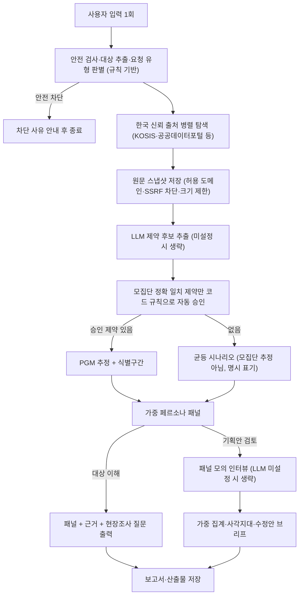

# E2P Agent (Evidence-to-Persona Agent)

공개 통계 근거로 가중 페르소나 패널을 합성하고, 정책·서비스 기획안의 사각지대와 실효성을 사전 검증하는 정책 연구 에이전트입니다. 모든 산출물에 출처·가중치·가정·불확실성이 함께 기록됩니다.

## 해결하려는 문제

근거 있는 페르소나를 만들려면 수많은 통계와 보고서를 일일이 찾고, 파편화된 데이터를 검토해 대표 유형과 비중을 직접 정해야 합니다. 일반 LLM에 맡기면 관련 없는 수치를 임의로 이어 붙이거나 근거 없는 가상 설정을 그럴듯하게 지어내는 위험이 있습니다.

E2P Agent는 조사 인력과 예산이 부족한 지자체·NGO를 위해, 공개 통계 탐색 → 원문 스냅샷 → 호환성 검증 → 가중 패널 구성 → 보고서까지를 하나의 실행으로 자동화합니다. 검증되지 않은 수치는 계산에 쓰지 않고, 근거가 부족하면 부족하다고 명시한 시나리오 결과를 내놓습니다.

## 왜 이 구조인가

- **오케스트레이션은 코드가 결정합니다.** 실행 순서, 승인 규칙, 안전 차단, 통계 계산은 전부 결정론적 코드입니다. LLM은 경로를 바꿀 수 없습니다.
- **LLM은 세 지점에서만 사용합니다.** ① 원문에서 제약 후보 추출, ② 페르소나 서술 생성, ③ 패널 모의 인터뷰. 전부 JSON 스키마 검증을 통과해야만 채택되고, LLM은 DB·솔버·네트워크에 직접 접근하지 못합니다.
- **LLM 없이도 동작합니다.** 모델 미설정 시 탐색·검증·통계·패널·보고서는 그대로 완료되고, 모의 인터뷰만 정직하게 생략됩니다.

## Input & Output

### 요청 유형 (키워드 규칙으로 자동 판별)

| 사용자 입력 예시 | 판별 | 실행 범위 |
| :--- | :--- | :--- |
| "서울 1인 가구를 위한 서비스 페르소나를 만들어줘." | 대상 이해 | 통계 탐색 → 호환성 검증 → 가중 패널 + 현장조사 질문 (모의 인터뷰 생략) |
| "서울 1인 가구를 위한 주말 커뮤니티 서비스를 검토해줘." | 기획안 검토 | 패널 생성 → 동일 패널 모의 인터뷰 → 사각지대·수정안 도출 |

판별은 LLM이 아니라 키워드 규칙입니다("페르소나", "알고 싶어" 등 → 대상 이해, 그 외 → 기획안 검토).

### 산출물

| 파일 | 내용 |
| :--- | :--- |
<<<<<<< HEAD
| `report.md` / `report.html` | 최종 결론, 근거·가정, 식별구간, 한계 |
| `policy_brief.md` | 정책 판정, 권리·법률 사전검토, 사각지대 가설, 현실 검증 계획 |
=======
| `report.html` | 최종 보고서 — 판정·권리 검토·사각지대 브리프, 반응 분포, 근거·가정, 식별구간, 한계 |
>>>>>>> 65d458aacfa0c1440f278e1af0c5ea2026f5366e
| `panel.jsonl` | 가중 페르소나 세그먼트(비중, 근거 수준, 해석 경계) |
| `interviews.jsonl` | 패널 모의 인터뷰 기록 — **LLM 미설정 시 비어 있음** |
| `evidence.json` | 저장한 출처, 제약, 제외 사유, 검색 후보 |
| `run.json` | 전체 실행 이력 재현용 매니페스트(sha256 포함) |

## 동작 방식



## 설치와 실행

Python 3.12 이상 필요.

```bash
# 설치
pip install -e ".[dev]"        # 또는: uv sync --extra dev

# 실행 (http://localhost:8000)
uvicorn app.asgi:app --port 8000
```

`.env.example`을 `.env`로 복사해 필요한 값만 채우면 됩니다. 서버가 시작할 때 자동으로 읽습니다.

| 환경 변수 | 필수 | 용도 |
| :--- | :--- | :--- |
| `LLM_API_URL`, `LLM_API_KEY`, `LLM_MODEL` | 선택 | OpenAI 호환 모델. 없으면 인터뷰·서술만 생략 |
| `PERSONA_RESTORER_DEMO_MODEL=1` | 선택 | 결정론 데모 응답(명시 라벨) — 모델·실제 조사 대체 아님 |
| `KOSIS_API_KEY`, `DATA_GO_KR_SERVICE_KEY` | 선택 | 한국 공공 통계 커넥터 |
| `GATEWAY_TOKEN` | 선택 | loopback 밖으로 노출 시 API 인증 토큰 |

## 테스트와 평가

```bash
PYTHONPATH=. pytest -q                    # 단위·통합 테스트
PYTHONPATH=. python evals/run_evals.py    # 결정론 평가셋
```

2026-08-01 기준 결과: 테스트 17/17, 평가 22/22 (안전 차단 6/6, 대상 이해 라우팅 4/4, 정상 경로 6/6, 대상 추출 5/5). 안전 케이스 100%와 전체 80% 이상이 CI 통과 조건입니다.

## 안전·개인정보 설계

- **안전 차단:** 정치적 설득·조작 표적화, 강압·배제 설계, 민감 특성 추론 요청은 계획 단계에서 차단됩니다.
- **네트워크 최소 권한:** 원문 수집은 공인 IP만 허용(SSRF·사설망 차단), 리다이렉트도 재검사, 응답 5MB 제한. 신뢰 등급은 한국 공공·연구기관 도메인 허용목록 기반입니다.
- **근거 게이트:** 모집단이 정확히 일치하고 원문 문장이 있는 제약만 코드 규칙으로 자동 승인됩니다(사람 검토가 아님을 이벤트에 명시). 불일치 제약은 수동 승인 시 명시적 override 사유를 요구합니다.
- **LLM 격리:** 모델은 도구 결과를 데이터로만 받고, 원문 텍스트로 지시를 주입해도 제약은 스키마 검증·승인 게이트를 통과해야만 계산에 반영됩니다.
- **합성물 표기:** 페르소나·인터뷰·설문은 전부 "완전 합성"으로 라벨되고, 성인 대상 확인 없이는 1인칭 페르소나를 만들지 않습니다.
- **비밀 관리:** API 키는 환경 변수로만 주입되고 저장소·산출물·로그에 기록되지 않습니다.

## 알려진 한계와 다음 단계

- 요청 유형·대상 추출이 키워드 규칙이라 표현이 다르면 놓칠 수 있습니다. 실패 사례가 쌓이면 LLM 분류로 교체 예정.
- 검색 커버리지가 신뢰 도메인 우선이라 최신 비정형 보고서를 놓칠 수 있습니다.
- 모의 인터뷰는 실제 시민 반응이 아니며, 보고서의 "현실 검증 계획"(소규모 시범·실제 설문)이 항상 후속 단계입니다.
- 제약 추출 정확도에 대한 LLM 의존 평가셋은 아직 없습니다(현재 평가는 결정론 구간만 커버).

## 라이선스

MIT. 아바타는 DiceBear notionists(CC0-1.0), 데이터 출처는 각 공공기관 이용약관을 따릅니다. 자세한 내용은 `THIRD_PARTY_ASSETS.md`.
