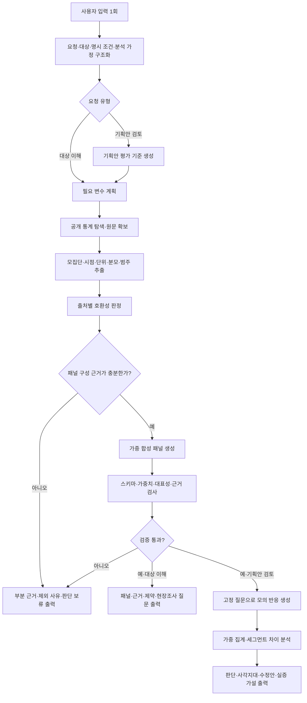

# E2P Agent(Evidence-to-Persona Agent)

공개 통계 데이터를 바탕으로 근거 기반의 가중 페르소나 패널을 자동 생성하고, 정책·제품·서비스의 사각지대와 실효성을 사전 검증하는 AI 에이전트입니다.

## 해결하려는 문제

근거 있는 페르소나를 만들려면 수많은 통계와 보고서를 일일이 찾고, 파편화된 데이터를 검토해 대표 유형과 비중을 직접 정해야 합니다. 이를 해결하고자 일반적인 AI를 활용하더라도, 관련 없는 수치를 임의로 이어 붙이거나 근거 없는 가상의 설정을 그럴듯하게 지어내는 위험이 있습니다.

E2P Agent는 조사 인력과 예산이 부족한 지자체·NGO의 이러한 한계를 극복하기 위해 개발되었습니다. 공개 통계 탐색부터 호환성 검증, 패널 구성까지 자동화함으로써 출처·가중치·불확실성이 명확히 검증된 재사용 가능한 페르소나 패널을 제공합니다.
이를 통해 전담 조사팀이 없는 조직이라도 공개 자료 기반의 정교한 가설을 세우고, 제한된 예산과 인력을 어디에 집중할지 명확히 판단할 수 있습니다.

에이전트는 사용자의 프롬프트를 분석하여 **'구체적인 정책·서비스 기획안'의 포함 여부를 스스로 판단**하고 최적의 파이프라인을 즉시 실행합니다.

## Input & Output

### 1. Input

| 사용자 입력 예시 | 분석 목적 | 시스템 핵심 프로세스 |
| :--- | :--- | :--- |
| **“서울 1인 가구를 위한 서비스 페르소나를 만들어줘.”** | 대상 이해 | 통계 데이터 탐색 ➔ 호환성 검증 ➔ 페르소나 패널 생성 |
| **“서울 1인 가구를 위한 주말 커뮤니티 서비스를 검토해줘.”** | 실효성 검증 | 패널 생성 ➔ **동일 환경 내 정책 시뮬레이션** ➔ 사각지대 도출 |

 

### 2. Output

투명한 데이터 근거 증명과 실무 적용을 위해 아래의 산출물을 제공합니다.

| 파일 | 내용 |
| :--- | :--- |
| `report.md` | 최종 결론, 세그먼트별 검토, 사각지대, 수정안 |
| `interviews.jsonl` | 패널을 기반으로 한 구조화된 모의 인터뷰 기록 |
| `panel.jsonl` | 가중 페르소나 데이터(비중 등), 출처, 제약, 제외 사유와 불확실성 |

## 동작 방식

