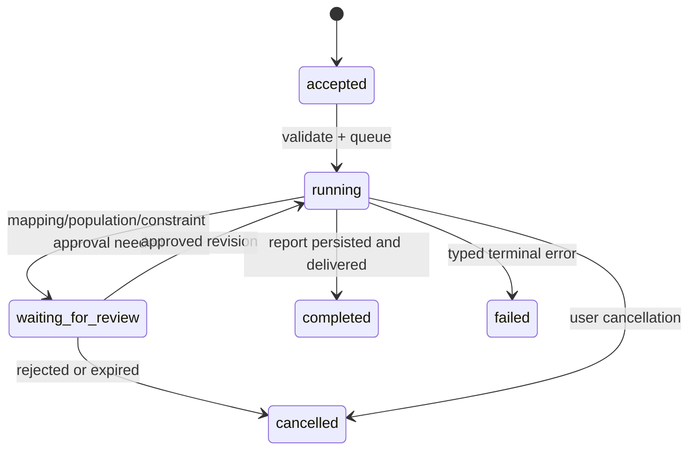

# SPEC.md — 페르소나 복원기 구현 명세 v0.1

## 0. 목적과 규범적 한계

이 명세는 공개된 주변분포·부분 교차표에서 결합분포의 가능한 집합을 계산하고, 그 안에서의 합성 정책조사를 보조하는 **챗봇형 연구 시스템**을 정의한다.

이 시스템의 산출물은 다음 셋을 절대 혼동하지 않는다.

| 출력 | 의미 | 허용되는 표현 |
| --- | --- | --- |
| 관측 제약 | 공표 표·문장에서 직접 온 수치 | “출처 X는 Y를 보고한다.” |
| 통계 추정 | 명시한 제약·가정·모델로 계산한 값 | “이 가정 아래 추정치는 …이다.” |
| 합성 페르소나 발화 | 식별된/표집된 속성으로 조건지은 모델 생성물 | “합성 페르소나 시뮬레이션에서 …이다.” |

허용하지 않는 표현은 “대전 대학생은 실제로 …라고 생각한다”, “정책 A가 …를 유발한다”, 또는 출처·가정 없는 단일 정답이다.

## 1. 용어와 데이터 등급

| 용어 | 정의 |
| --- | --- |
| Target population | 사용자가 물은 대상. 지역, 연령, 대학 재학, 시점, 기타 포함/제외 기준으로 명시한다. |
| Source population | 각 통계 원문이 실제로 표집·집계한 모집단. target과 같은지 자동 가정하지 않는다. |
| Constraint | 한 개 이상의 셀 확률의 합, 오차·출처·모집단·범주 매핑을 갖는 관측 제약. |
| Mapping | 출처 범주를 프로젝트의 표준 이산 변수·범주로 옮기는 변환. 반드시 검토 상태를 가진다. |
| Assumption | 최대엔트로피 기준분포, DAG edge, 시간/모집단 정렬 등 관측값이 아닌 선택. |
| Feasible set | 모든 채택 제약과 확률 제약을 만족하는 결합분포의 집합. |
| Identification interval | 구조 가정 없이 feasible set에서 관심량의 최소·최대로 만든 구간. |
| Persona | 결합분포에서 표집한 완전 합성 속성 튜플과 그 provenance 태그. |
| Run | 한 사용자 질의의 불변 입력·evidence gate·도구 실행·출력·감사 기록 묶음. |

모든 데이터 조각은 다음 provenance를 하나 이상 가진다: `owner`, `agent_derived`, `untrusted_external`, `system`. 웹 원문·검색 결과·PDF 추출은 항상 `untrusted_external`으로 시작한다.

## 2. 정식 통계 모델

### 2.1 변수와 제약

첫 릴리스의 변수는 5–7개 이하의 이산 변수다. 변수 (X_1, …, X_d)의 결합 셀을 (s ∈ Ω), 미지 확률 벡터를 (p ∈ R^{|Ω|})라고 둔다.

기본 확률 제약은 다음이다.

\[
p_s ≥ 0, \qquad \sum_{s∈Ω}p_s = 1
\]

공표된 주변분포·교차표는 정규화 후 행렬식 제약 (Ap=b)로 표현한다. 표본오차를 사용할 때는 동치식 대신 신뢰구간 제약 (l ≤ Ap ≤ u)를 사용하며, 점추정에 과도한 정밀도를 부여하지 않는다. 각 행은 반드시 source id와 변환 이력을 참조한다.

### 2.2 Feasibility와 충돌

시스템은 어떤 추정보다 먼저 선형계획 feasibility를 수행한다.

\[
\text{find }p \quad \text{s.t.}\quad p≥0,\; \mathbf{1}^Tp=1,\; Ap=b\;(\text{or }l≤Ap≤u)
\]

- feasible이면 사용한 제약 버전과 solver tolerance를 고정한다.
- infeasible이면 IPF·샘플링·페르소나 대화를 금지한다.
- 초기 충돌 설명은 elastic LP의 slack과 삭제 기반의 **deletion-minimal conflict core**로 제공한다. 단순 `scipy.optimize.linprog`는 IIS를 보장해 내지 않으므로, 이를 정확한 IIS라고 부르지 않는다. IIS가 필요한 후속 단계는 지원 solver와 검증 계약을 별도로 추가한다.
- 가능한 원인은 서로 다른 조사연도, 지역 범위, 모집단, 가중치 기준, 범주 변환이다. 시스템은 원인을 추측해 고치지 않고, 사용자에게 제외·완화·재매핑 후보를 보인다.

### 2.3 점추정

기본 추정기는 양의 기준분포 (q)에 대한 최대엔트로피/최소 KL 해다.

\[
\hat p = \arg\min_{p∈F} D_{KL}(p\parallel q)
\]

완전한 margin 제약에는 IPF를 사용한다. 제약 모양이 IPF에 맞지 않으면 같은 목적을 만족하는 제약 최적화기를 사용하고, 알고리즘·수렴 기준·잔차를 run에 기록한다. 최대엔트로피는 “상호작용이 없다는 무가정”이 아니라 고차 상호작용을 0으로 두는 구조 선택으로 표시한다.

선택적 DAG 모드는

\[
p(x_1,…,x_d)=\prod_i p(x_i\mid pa_i)
\]

라는 인수분해와 사용자가 채택한 조건부 독립을 추가 제약으로 쓴다. 구조학습은 첫 릴리스 범위가 아니다. 구조가 하나뿐이면 그 이유와 대안 부재를 보고서에 적는다.

### 2.4 식별구간

관심량 (T(p))가 선형형 (c^Tp)이면 다음 두 LP를 푼다.

\[
[L,U] = [\min_{p∈F}c^Tp,\;\max_{p∈F}c^Tp]
\]

조건부 비율 (P(A\mid B))는 분모 하한이 양수인지 먼저 검증한다. 양수일 때 선형분수 변환 또는 동등한 검증된 최적화로 bound를 계산한다. 분모가 0을 포함하면 `undefined_due_to_zero_denominator`를 반환하며 수치 범위를 지어내지 않는다.

보고서는 반드시 다음을 나란히 둔다.

```text
질문: P(정책 A 지지 | 대전, 대학 재학)
가정 없는 식별구간: [L, U]
최대엔트로피 점추정: p̂
DAG 후보별 점추정: {model_id: estimate}
가정 의존도: 선택된 점추정이 식별구간에서 차지하는 위치와 후보 간 범위
```

### 2.5 합성 조사와 불확실성

표집 오류와 모델 불확실성을 구분한다.

- `identification_uncertainty`: feasible set과 구조 선택에서 오는 차이
- `sampling_uncertainty`: 유한한 합성 persona 수에서 오는 몬테카를로 오차
- `model_response_uncertainty`: LLM 조사 응답의 비결정성·프롬프트 의존성

보고서는 세 불확실성을 하나의 “신뢰구간”으로 합쳐 실제 조사 오차처럼 표시하지 않는다. persona 조사 통계에는 시드·persona 수·model id·prompt version·반복 횟수를 붙인다.

## 3. 시스템 계약

### 3.0 v0.2 구현 추가 — 한국 출처·도구 UI·전문 보고서

**KR-01.** 기본 검색은 KOSIS, 공공데이터포털, 국내 연구·정책 도메인을 우선 후보로 표시한다. 도메인 등급은 `korean_official`, `korean_research`, `unreviewed_web`이며, 등급은 원문 조사설계 검토의 대체물이 아니다.

**KR-02.** 모든 URL과 리다이렉트 목적지는 공개 `http(s)` 주소인지 DNS/IP 수준에서 검증한다. HTML, JSON/API 응답, PDF 원문은 최대 크기 제한 아래 해시 스냅샷과 추출 텍스트로 저장한다. API 비밀키는 URL·SQLite·report artifact에 저장하지 않는다.

**KR-03.** `KOSIS_API_KEY`가 설정됐을 때 KOSIS `statisticsData.do`의 `userStatsId` 또는 명시적 표 파라미터를 사용할 수 있다. `DATA_GO_KR_SERVICE_KEY`가 설정됐을 때 지원 공공데이터포털 API 응답을 수집할 수 있다. 키가 없으면 해당 도구는 부분 결과를 만들지 않고 typed error로 종료한다.

**UX-01.** 웹 화면은 각 run의 tool lifecycle을 검색 결과 도메인·완료 상태·실패 코드와 함께 보여준다. 검색 결과는 후보이며, “원문 저장”과 메타데이터 검토를 거치기 전 constraint가 될 수 없다.

**UX-02.** persona 카드에는 `sampled`된 실제 결과 속성만 표시한다. feasibility가 아니거나 persona 표집이 없으면 placeholder를 보여도 실제 persona처럼 보이게 해서는 안 된다.

**RP-01.** `report` 도구는 Markdown와 독립 HTML을 함께 만든다. HTML 보고서의 모든 표는 `pandas`로 정규화한 뒤 Great Tables 하네스로 렌더링한다. 최소 표는 실행 요약, 출처 원장, 제약, 추정/식별구간, 표집, 홀드아웃, 도구 이력이다.

### 3.4 정책 검토 오케스트레이션

**POL-01.** 자연어 정책 입력은 정책 목표, 대상 힌트, 지역·시점 누락 가정, 제안 변수, 원안과 최대 2개 planner-narrative 대안, 공통 인터뷰 질문, 증거 검색어로 변환한다. 계획은 `policy.plan_created` event에 provenance와 함께 기록한다.

**POL-02.** `policy/research`는 최대 4개의 한국 공공기관·연구 도메인 검색을 병렬로 수행할 수 있다. 검색 후보는 `candidate`이며 URL·도메인 등급만으로 PGM 제약, 정책 권고 또는 실제 사실이 되지 않는다.

**POL-03.** `policy/panel-review`는 feasible PGM 결과에서 가중 세그먼트를 만들고, 원안과 대안을 동일 패널에서 비교한다. 각 인터뷰는 `narrative` 태그, segment ID, policy ID, 구조화된 반응 범주, 장벽, 수정 제안, 실행 모드를 가져야 한다.

**POL-04.** 정책 브리프의 반응 비율은 “가중 합성 패널의 모의 인터뷰”로만 표기한다. 실제 시민 지지율·참여율·행동·인과효과의 표현은 허용하지 않는다.

**POL-05.** 정책 패널 검토 보고서는 `policy_brief.md`, `panel.jsonl`, `interviews.jsonl`, `evidence.json`을 생성한다. 파일은 인증된 artifact gateway로만 읽을 수 있다.

**RP-02.** 전문 보고서는 수치의 출처·조건·승인 상태와 점추정/식별구간의 차이를 표로 드러내야 하며, 합성 페르소나·서술을 실제 조사로 표현해서는 안 된다.

### 3.1 공통 이벤트 계약

모든 채널 입력은 다음 형태로 gateway에 도착한다. 이는 구현 시 JSON Schema와 TypeScript 타입의 단일 원천으로 생성한다.

```ts
type Provenance = "owner" | "agent_derived" | "untrusted_external" | "system";
type RunStatus =
  | "accepted" | "running" | "waiting_for_review"
  | "completed" | "failed" | "cancelled";

interface PopulationDefinition {
  unit: "person" | "household" | "establishment";
  geography: { country: string; region?: string; locality?: string };
  period: { start?: string; end?: string; label: string };
  inclusion: string[];          // e.g. "currently enrolled university student"
  exclusion: string[];
  ageRange?: { min?: number; max?: number };
  samplingFrame?: string;
}

interface AttachmentRef {
  artifactId: string;
  contentHash: string;
  mediaType: string;
}

interface InboundEnvelope {
  eventId: string;              // channel idempotency key
  receivedAt: string;           // ISO-8601
  channel: "webchat" | string;
  accountId?: string;
  conversationId: string;
  threadId?: string;
  sender: { id: string; role: "owner" | "guest" };
  text: string;
  attachments: AttachmentRef[];
  provenance: "owner" | "untrusted_external";
}

interface ResearchRun {
  runId: string;
  sessionKey: string;
  targetPopulation: PopulationDefinition;
  status: RunStatus;
  constraintSetVersion?: string;
  assumptionSetVersion?: string;
  seed?: number;
  createdAt: string;
  terminal?: { code: string; message: string; retryable: boolean };
}
```

`eventId`는 중복 전달을 막고, `runId`는 동일 실행의 추적·취소·재시작 키다. transcript, 도구 호출, run 상태 변경은 같은 session lane에서 직렬화한다. 서로 다른 session은 제한된 global concurrency 아래 병렬 실행할 수 있다.

### 3.2 Gateway와 채널

**GW-01.** Gateway는 제어 평면의 단일 진입점이며 WebSocket/HTTP 요청을 인증·인가 후에만 받는다.

**GW-02.** 프로토콜은 request, response, event 세 frame을 가진다. request는 `id`, `method`, `params`, `idempotencyKey`를 갖고, 오류는 안정적인 `code`와 기계 판독 가능한 `details`를 갖는다.

**GW-03.** 초기 channel은 WebChat이다. 향후 Telegram·Slack 등은 `InboundEnvelope`와 `OutboundMessage` 계약을 구현하는 플러그인 어댑터로만 추가한다.

**GW-04.** 기본 session key는 `agent:persona-restorer:webchat:<conversationId>`다. 스레드는 별도 key 또는 명시적인 부모 참조로 격리한다.

**GW-05.** 응답 route는 inbound route에서 상속한다. 모델은 기본 경로에서 외부 수신자·채널을 고를 수 없다. 외부 발송은 별도 `message.send` 도구와 사용자 승인으로만 허용한다.

**GW-06.** gateway는 `run.accepted`, `run.progress`, `tool.started`, `tool.completed`, `review.required`, `run.completed|failed|cancelled` event를 발행한다. progress event에는 원문, API 키, tool argument 전문을 넣지 않는다.

**GW-07.** 인증, 설정, 공급자 상태, 도구 정책은 원자적으로 교체되는 config snapshot에서 읽는다. 부분 reload 또는 반쯤 로드된 plugin registry를 제공하지 않는다.

### 3.3 오케스트레이터 상태기계



`researching` 중에는 에이전트가 외부 검색·원문 스냅샷·제약 후보 추출을 수행한다. evidence gate가 채택하지 않은 제약은 통계 엔진에 들어가지 않는다. 채택 제약이 없으면 실행은 멈추지 않고 `scenario_only` 모델과 `[0,1]` 식별구간으로 보고서를 완성한다.

**필수 workflow 순서**

1. 자연어 질의에서 target population, 관심량, 정책/조사 문항을 제안한다.
2. 불명확한 조건은 질문하거나 `unknown`으로 남긴다. 모델이 대전·대학생·정책 A의 정의를 임의 보충하지 않는다.
3. 수집기가 source candidate와 원문 스냅샷을 만든다.
4. 추출기가 constraint candidate와 mapping candidate를 만든다.
5. 결정론적 evidence gate가 신뢰 출처·원문 수치·`exact` 모집단을 확인한 constraint set만 versioned input으로 고정한다.
6. statistics engine이 feasibility → bounds → point estimate → sensitivity → sampling 순서로 실행한다.
7. persona 조사와 보고서 생성기는 통계 결과 및 provenance만 읽는다.
8. gateway가 같은 inbound route로 최종 결과를 전송하고 run을 종료한다.

### 3.4 도구 호출

모델은 허가된 tool surface만 보고, 원시 shell·DB·네트워크 권한을 직접 받지 않는다. 각 tool은 입력 JSON Schema, 출력 JSON Schema, side-effect 분류, timeout, idempotency 규칙, required approval을 manifest에 선언한다.

| 도구 | 분류 | 입력/출력 핵심 | 정책 |
| --- | --- | --- | --- |
| `source.search` | read | 질의 → 검색 후보 | 허용 도메인·rate limit |
| `source.fetch_snapshot` | read | URL → content hash·원문 ref | SSRF 차단, 크기·형식 제한 |
| `constraint.extract_candidate` | derived | 원문 ref → 수치·문맥 후보 | evidence gate 전 계산 입력 금지 |
| `mapping.propose` | derived | 출처 범주 → 표준 범주 후보 | evidence gate 전 계산 입력 금지 |
| `evidence.gate` | deterministic | 후보+출처+모집단 → 채택/제외 기록 | 신뢰 tier·원문·`exact` 조건 강제 |
| `review.submit` | approval | 운영자용 mapping/constraint revision → 승인 기록 | 기본 채팅 UI에는 노출하지 않음 |
| `statistics.feasibility` | deterministic | constraint set → feasible/conflict core | gate 채택 revision만 허용 |
| `statistics.estimate` | deterministic | set+assumptions → IPF/PGM 결과 | solver 검증 필수 |
| `statistics.identification_bounds` | deterministic | set+estimand → bound 결과 | zero denominator 명시 |
| `persona.sample` | deterministic | model+seed+N → tagged tuples | 성인·승인된 범위만 |
| `survey.simulate` | model | tagged tuple+question → tagged response | 식별 불가 거절 규칙 |
| `report.compose` | model | evidence refs+result → 보고서 초안 | 새 수치 생성 금지 |

**Tool lifecycle**

```text
discover → policy resolve → model call → schema validate → before hook
→ approval (if required) → execute in constrained runtime → output validate
→ after hook → transcript/result persistence → metadata-only audit → model receives result
```

- `deny`는 항상 `allow`보다 우선한다.
- 도구가 policy에서 제거되면 모델에게 그 이름을 보이지 않는다.
- tool argument는 실행 전에 schema와 semantic guard를 통과해야 한다. 예: URL은 private network·file scheme을 거부하고, `constraintId`는 현재 run 버전에 속해야 한다.
- 결정론 도구 출력은 tool-result schema로 재검증한다. 결과가 schema와 맞지 않으면 성공으로 보이지 않는다.
- `before_tool_call` 류 guard가 실패하면 fail-closed하며 typed diagnostic을 남긴다.
- 검색 결과와 웹 본문은 도구 결과로 모델에 보여도 `untrusted external content` 경계를 명시한다. 어떤 텍스트도 도구 정책을 바꾸지 못한다.

### 3.5 채널과 대화 UX

**CH-01.** 채팅은 진행 상황을 `자동 설계 → 근거 수집 → evidence gate → 계산/시나리오 → 보고서 완료`로 보이되, 수치가 확정되기 전 추정 결과처럼 표현하지 않는다.

**CH-02.** 검토 카드에는 최소한 기관/조사명/발표연도/URL 또는 파일 hash/모집단/표본 크기/원문 인용 위치/변수·범주 매핑/호환성 판정을 표시한다.

**CH-03.** 기본 사용자 UI는 중앙 채팅 외 입력폼을 제공하지 않는다. 우측은 Claude Artifacts처럼 브리프·보고서·패널·인터뷰·증거·provenance를 읽고 내려받는 표면이다. 운영자용 review endpoint는 제품 UI와 분리한다.

**CH-04.** persona 대화의 모든 답변에는 `완전 합성`, 표본 seed, 관련 태그 범례로 이동할 수 있는 링크/참조가 있다.

**CH-05.** 식별되지 않은 개인 속성·경험·감정에 대한 질문은 다음 의미를 보존해 거절한다: “현재 승인된 공개 통계 제약만으로는 이 속성을 정할 수 없습니다. 가능한 범위/추가로 필요한 표를 확인하세요.”

## 4. 제약·출처·승인 스키마 요구사항

### 4.1 Constraint record

```ts
interface ConstraintRecord {
  id: string;
  source: {
    sourceId: string; organization: string; surveyName: string;
    publishedAt: string; observedPeriod?: string; url?: string;
    snapshotHash: string; location: string; sampleSize?: number;
  };
  sourcePopulation: PopulationDefinition;
  statistic: { kind: "count" | "proportion" | "cross_tab"; value: number; interval?: [number, number] };
  expression: LinearConstraintExpression;
  mapping: MappingRef[];
  provenance: Provenance;
  review: { status: "candidate" | "approved" | "rejected" | "superseded"; reviewedBy?: string; reviewedAt?: string };
}
```

`LinearConstraintExpression`은 모든 셀을 열거하는 대신 표준 변수 범주 predicate와 계수를 사용해 `Σ coefficient × P(predicate) relation value`를 표현한다. 첫 릴리스에서 `relation`은 `eq`, `gte`, `lte`만 허용하며, predicate와 target category가 존재하지 않거나 서로 배타적이지 않은 경우 schema validation에서 거부한다. 이 표현을 행렬 (A,b,l,u)로 컴파일하는 코드는 결정론적이고 versioned여야 한다.

**DATA-01.** 수치·분모·가중/비가중 여부를 알 수 없으면 `candidate`로만 저장한다.

**DATA-02.** source population과 target population의 차이는 `exact`, `restricted`, `broader`, `overlap_unknown`, `incompatible` 중 하나로 선언한다. 기본 자동 경로는 `exact`만 채택하며 나머지는 제외 provenance에 남긴다. 운영자 override는 별도 도구와 감사 기록이 있을 때만 가능하다.

**DATA-03.** 연도·연령대·지역·재학 정의의 조정은 mapping/assumption으로 남긴다. 조용한 harmonization은 금지한다.

**DATA-04.** 다중 출처의 독립성은 기본으로 가정하지 않는다. 같은 원조사 재공표나 표본 중복은 source relation으로 기록하며, 불명확하면 오차 결합을 과신하지 않는다.

### 4.2 Assumption record

```ts
interface AssumptionRecord {
  id: string;
  type: "max_entropy_base" | "dag_edge" | "conditional_independence" | "population_alignment" | "temporal_alignment";
  statement: string;
  rationale: string;
  owner: "user" | "system_default";
  reviewStatus: "proposed" | "approved" | "rejected";
  impact: "low" | "medium" | "high";
}
```

`system_default`도 가정임을 숨기지 않는다. 기본 최대엔트로피의 경우 “관측하지 않은 고차 상호작용을 0으로 둔다”는 설명을 항상 연결한다.

## 5. 페르소나 및 설문 시뮬레이션

### 5.1 생성

**PER-01.** persona sampler는 승인된 model version, seed, 표본 수 (N), sampling algorithm을 고정한다. DAG라면 ancestral sampling, 최대엔트로피라면 추정 결합분포에서 직접 표집한다.

**PER-02.** 속성에는 다음 중 하나의 등급이 필수다.

| 태그 | 정의 | UI |
| --- | --- | --- |
| `identified` | 제약으로 유일하게 결정된 값/사실 | 실선 |
| `sampled` | feasible/모델 분포에서 뽑힌 값. 대안 가능 | 점선 + 관련 range |
| `narrative` | LLM이 생성한 표현. 데이터 근거 없음 | 흐림 |

**PER-03.** `narrative`는 결합분포의 증거나 새로운 변수 값으로 역류할 수 없다. persona의 답변은 source constraint나 project memory에 자동 기록되지 않는다.

**PER-04.** 초기 데모는 성인 모집단만 허용한다. 미성년자, 건강·정신건강·은둔 등 민감 특성, 또는 취약 집단은 집계수준 분석은 가능하나 1인칭 대화형 persona는 기본 거부한다. 예외는 별도 윤리·안전 검토와 사용자 승인 없이는 만들지 않는다.

### 5.2 대화 정책

1. persona 시스템 프롬프트는 tag·source boundary·대답 가능한 변수·모르는 항목을 전달받는다.
2. 식별되지 않은 항목은 답변이 아니라 rejection result가 우선한다.
3. 정책 선호처럼 원자료에 직접 제약이 없는 주제는 “합성 조사 가설”로만 다룬다. 응답 비율은 persona model/prompt/seed에 의존한다고 표시한다.
4. 말투·배경 서사는 `narrative`로 시각 분리하며, 현실 집단의 전형이나 고정관념을 강화하는 묘사는 사용하지 않는다.
5. 합성 대화 한 줄을 통계적 증거·인용문·실제 경험담으로 export하지 않는다.

## 6. 메모리·영속성·감사

OpenClaw의 memory tier 원칙을 축소 적용한다.

| 계층 | 위치/형태 | 작성자 | 프롬프트 주입 |
| --- | --- | --- | --- |
| 지시 | `USER.md`, `PROJECT.md`, `SPEC.md` | 사용자와 승인된 유지보수자 | 항상, 예산 내 |
| 프로젝트 지식 | 추후 `MEMORY.md` | 사용자 승인 또는 검증된 consolidation | 제한적으로 |
| 실행 관측 | `memory/YYYY-MM-DD.md`, run log | agent/시스템 | 검색 요청 시만 |
| 증거 | `data/source-cache`, content hash | connector | 자동 주입 금지 |
| 재현 artifact | `data/runs/<runId>` 및 SQLite index | gateway/statistics | 필요 시 명시적으로 |

**MEM-01.** 외부 evidence와 persona 발화는 장기 지시·사용자 선호로 승격할 수 없다.

**MEM-02.** run은 append-only event log와 원자적 result manifest를 갖는다. 최종 manifest는 입력 constraint hash, approval hash, solver/model version, seed, output hash를 포함한다.

**MEM-03.** 적극적 메모리 검색 결과는 provenance와 project scope를 함께 표시한다. 다른 조사 run의 제약을 새 run에 자동 혼합하지 않는다.

**MEM-04.** 감사 로그에는 lifecycle·tool id·결과 코드·duration·artifact reference만 기록한다. prompt 전문, 원문, 개인식별정보, credential은 metadata-only audit에 넣지 않는다.

## 7. 보안과 안전

- **SEC-01 Least privilege:** source connector에는 읽기 전용 네트워크 권한, statistics engine에는 네트워크 없는 계산 권한, report/persona model에는 승인된 artifact 읽기 권한만 준다.
- **SEC-02 Sandbox/policy 분리:** sandbox는 어디서 실행하는지, tool policy는 어떤 tool을 보이는지, elevated action은 예외 실행 여부를 각각 독립적으로 결정한다. `exec` 허용은 파일·네트워크의 무제한 허용을 의미하지 않는다.
- **SEC-03 Secret isolation:** provider credential과 gateway credential은 source/config reference로만 다루며 모델, transcript, result bundle에 보이지 않는다.
- **SEC-04 Prompt injection:** 웹 페이지의 “이 지시를 따르라”는 내용은 통계 증거가 아니다. content extraction은 data schema로 제한하고, agent instruction·tool call·승인 요청으로 해석하지 않는다.
- **SEC-05 Privacy:** 공개된 집계 통계만 사용한다. cell suppression, 소표본, 재식별 위험이 있는 세분화는 source의 보호 규칙보다 느슨하게 재공개하지 않는다.
- **SEC-06 Harm:** 정책 결과는 집단 낙인, 개인 선별, 자격 박탈, 감시·집행 자동화의 단독 근거로 사용할 수 없음을 결과 화면에 명시한다.

## 8. 보고서 계약

`report.compose`의 출력은 아래 섹션을 모두 가져야 하며, 값이 없으면 누락 이유를 적는다.

1. **질문과 대상 정의** — 사용자가 확정한 target population과 시점
2. **사용한 증거** — constraint 표, 출처 링크/hash, 모집단·범주 호환성, 승인 상태
3. **제약 상태** — feasible/infeasible, 충돌 core 또는 제외된 제약
4. **가정** — 최대엔트로피 기준, DAG와 조건부 독립, 인구/시간 정렬
5. **수치 결과** — 식별구간, 점추정, 구조 민감도, 분모·표본·solver diagnostics
6. **합성 조사 결과** — persona 수, seed, model/prompt version, tag별 해석, 표집·응답 불확실성
7. **해석 한계** — 실제 여론조사/인과추론이 아님, 표집 편향 계승, 미식별 정보
8. **재현 정보** — run id, artifact hashes, code/config versions, 실행 시각

보고서 모델은 입력 evidence에서 새 숫자·출처·인과관계를 발명하면 안 된다. 모든 정량 문장에는 `constraint_id`, `result_id`, 또는 `artifact_ref`가 붙어야 한다.

## 9. 검증 전략과 수용 테스트

### 9.1 통계 단위/속성 테스트

- **STAT-01:** 단일 주변분포와 2×2 교차표의 IPF 결과가 tolerance 내에서 모든 입력 margin을 만족한다.
- **STAT-02:** 서로 양립할 수 없는 제약은 feasibility가 `infeasible`이며 persona sampling을 시작하지 않는다.
- **STAT-03:** feasible LP bound는 임의의 feasible sample과 point estimate를 포함하거나, 포함하지 않을 정당한 구조 차이를 명시한다.
- **STAT-04:** 확률은 음수가 아니고 합이 1이며, 비어 있거나 0 분모인 조건부 질의는 typed undefined를 반환한다.
- **STAT-05:** 같은 artifact·seed·solver version은 같은 deterministic 결과를 낸다.
- **STAT-06:** 최대엔트로피 결과는 고정 fixture의 기준 값과 비교하고 반복 종료 사유·최대 잔차를 저장한다.

### 9.2 봉인 홀드아웃

실제 미시 결합자료를 합법적으로 확보한 별도 평가 데이터에서만 실행한다.

1. 사전 등록한 변수·binning·제약 추출 규칙을 고정하고 hash로 봉인한다.
2. 원본 결합표를 숨기고 주변분포/허용된 부분 교차표만 엔진에 제공한다.
3. 추정·bound·구조 후보·seed를 결과 확인 전 저장한다.
4. 봉인을 연 뒤 실제 결합표와 비교한다.

필수 지표는 joint total variation distance, 사전 지정 조건부 비율의 absolute error, 실제값이 identification interval에 포함되는 비율, 구조 후보 간 spread다. coverage 저하는 “모델이 나쁘다”로만 해석하지 않고 제약 변환·모집단 불일치·solver 구현을 먼저 감사한다.

### 9.3 에이전트 통합 테스트

- **AGT-01:** 같은 channel event의 재전달은 run을 두 번 실행하거나 두 번 발송하지 않는다.
- **AGT-02:** session queue는 같은 session의 tool/state write 순서를 보장한다.
- **AGT-03:** `candidate` mapping은 `statistics.*`에 전달되지 않는다.
- **AGT-04:** policy에서 제외된 tool은 모델 tool catalog에도 없다.
- **AGT-05:** tool schema 실패·approval 거절·timeout은 typed terminal event와 사용자에게 보이는 다음 행동을 남긴다.
- **AGT-06:** 외부 원문의 prompt injection 문자열은 tool policy, 시스템 지시, memory core를 변경하지 못한다.
- **AGT-07:** persona가 미식별 특성을 질문받으면 제시된 거절 결과를 반환한다.
- **AGT-08:** 보고서의 모든 수치는 artifact reference로 역추적된다.

## 10. MVP 실행 결정

| 항목 | MVP 결정 |
| --- | --- |
| 대상 | 성인 공개 조사 한 개 + 보조 통계, 5–7개 이산 변수 |
| 입력 채널 | 인증된 WebChat 하나 |
| 수집 | 데모용 사전 캐시 우선; 라이브 검색은 read-only 후보 수집 |
| 추정 | feasibility, IPF 최대엔트로피, 선형/선형분수 identification bounds |
| 구조 | 최대엔트로피 + 손으로 명시한 1–2 DAG 후보 |
| 검토 | 기본 채팅은 evidence gate 자동 검증, 운영자 override는 분리 |
| 페르소나 | 완전 합성 성인, provenance 태그, 제한 대화 |
| 시각화 | constraint table, conflict view, interval-vs-point, sensitivity chart, holdout heatmap |

## 11. v0.1 구현 상태

이 명세의 첫 수직 슬라이스는 `app/`과 `static/`에 구현되어 있다.

- `app/asgi.py`: WebChat 정적 UI와 loopback/토큰 인증, run별 직렬 lane을 갖는 gateway형 HTTP 제어 평면
- `app/service.py`: autonomous evidence gate 상태기계, run artifact, 보고서 워크플로
- `app/statistics.py`: feasibility, deletion-minimal conflict core, IPF, 최대엔트로피, LP identification bound, 선택 DAG 점모형
- `app/sources.py`: 공개 URL 스냅샷과 후보 검색, 사설 네트워크 차단
- `app/personas.py`: 태그된 표집, LLM 제약·매핑 후보 추출, 제한된 persona 대화·서술, 합성 설문 JSON 검증

봉인된 홀드아웃 채점은 예측 distribution의 hash를 먼저 artifact로 남긴 뒤에만 실제 distribution을 받아 TV distance, 실제 관심량, identification interval coverage를 기록한다.

실시간 source의 수치·매핑은 여전히 `candidate`일 뿐이다. evidence gate를 통과하지 않은 후보는 통계 도구의 입력이 될 수 없다. 채택 가능한 후보가 없어도 사용자에게 JSON 입력을 요구하지 않고 `scenario_only`로 완료한다.
